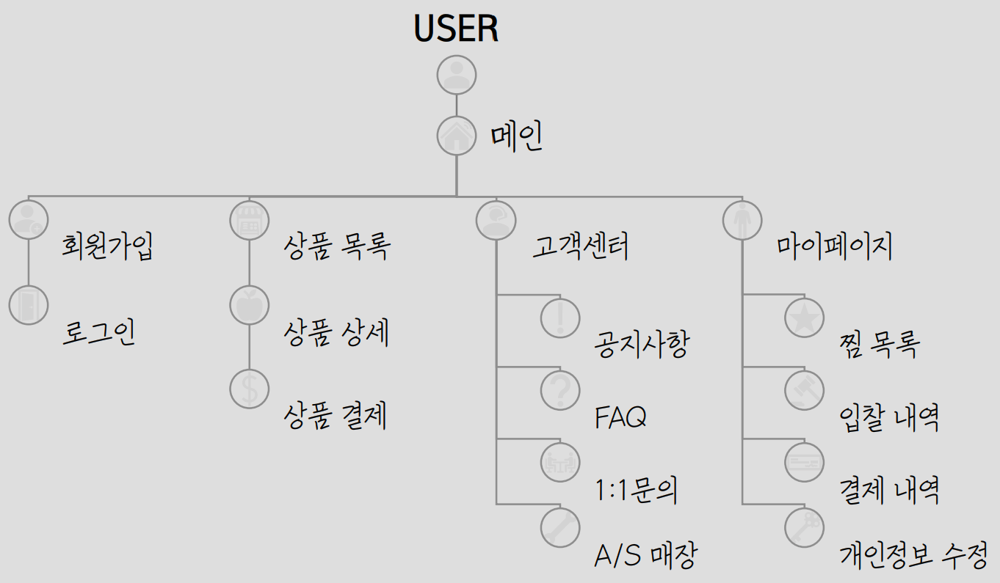

# 리퍼브 제품 경매 사이트(refurmoa)

## 🚀 프로젝트 소개
리퍼모아는 소비자의 경제적 부담을 덜고 합리적 소비를 장려하는 혁신적 플랫폼입니다.<br> 
리퍼모아는 신제품 못지않은 품질을 자랑하는 리퍼브 상품을 합리적인 중고가격으로 제공함으로써, 품질과 가격 사이의 균형을 찾아 제공합니다.<br>
세심한 하자 정보 제공과 효율적인 경매 시스템의 도입을 통해, 고객은 가치 있는 상품을 저렴한 가격에 입수할 수 있는 기회를 가집니다.<br>
이 프로젝트는 단순한 비용 절감을 넘어, 소비 문화에 혁신을 가져오며 새로운 소비 기준을 세우는 것을 목표로 합니다.


## ✨ 프로젝트 핵심 기능 및 사용 API
<details>
  <summary><b>상세 기능</b></summary>


</details>

### 사용자 경험

- **메인 페이지:** 상품 카테고리별 조회, 특별 행사 배너, 상품 추천 시스템
- **계정 관리:** 회원가입, 로그인, 비밀번호 및 아이디 찾기, 회원 정보 관리

### 상품 관리

- **상품 등록/수정:** 제휴 회사와의 연동, 이미지 업로드, 상품 정보 수정 기능

- **상품 조회:** 다양한 필터링 옵션을 통한 상품 리스트 조회 및 관리

### 고객 서비스

- **1:1 문의:** 사용자별 맞춤 문의 등록 및 관리

- **FAQ/공지사항:** 사용자들의 질문에 대한 빠른 접근과 최신 정보 제공

### 관리자 기능

- **주문/배송 관리:** 주문 정보 조회, 배송 상태 관리, 송장번호 입력

- **회원 관리:** 회원 정보 조회 및 관리, 쿠폰 및 마일리지 관리

### API

- **Firebase:** 사용자 인증 서비스

- **Daum-post:** 주소 검색 서비스

- **결제 API:** 다양한 결제 옵션 제공


## 🔧 기술 스택


## 🌟 시작하기


### 전제 조건

- JDK 17 이상 설치
- React 설치
  - Node.js가 사전에 설치되어 있어야 합니다
- Yarn 설치
  - Yarn 패키지 매니저는 npm install -g yarn 명령어로 설치
- MySQL Workbench 설치

### 설치 방법

```bash
# 프론트엔드 소스 코드 클론하기
git clone https://github.com/refurmoa/refurmoa-front-
cd refurmoa-front- # 클론한 디렉토리로 이동

# 필요한 Node.js 패키지 설치
yarn install

# 터미널에서 프론트엔드 실행
yarn start

# MySQL Workbench 실행 및 데이터베이스 설정

# 백엔드 소스 코드 클론하기
git clone https://github.com/choihyunjun123/refurmoa
cd refurmoa # 클론한 디렉토리로 이동

# 애플리케이션 빌드
./gradlew build

# 빌드된 애플리케이션 실행
./gradlew bootRun

```

## 📊 ERD 설계
<br>
상세한 데이터 모델 설계는 [ErdCloud](https://www.erdcloud.com/d/59sx58tdeKQKypHxi)에서 확인할 수 있습니다.

## 🔨 API 문서
자세한 API 문서는 [여기](https://jjunys.notion.site/API-1d1ae31ea0ee43a392e36e31eef4d4a5?pvs=4)에서 확인할 수 있습니다.

## 🌁 계층 구조

### USER


### ADMIN


## 📝 기술적 문제 해결 방법 및 사용 이유

### 카카오 API를 활용한 지도 로딩 속도 최적화

- 전체 데이터를 한 번에 불러오면 처리해야 할 데이터 양이 급증하여 로딩 시간이 상당히 증가함
- 지도 상에 표시되는 데이터를 페이징 처리함으로써, 사용자가 지도를 이동하거나 확대/축소할 때 그에 맞는 지역 데이터만 실시간으로 요청하고 로드

[//]: # (상세한 구현 방법과 기술적 세부사항은 [블로그 포스트]&#40;&#41;에서 확인할 수 있습니다.)

### 실시간 입찰 시스템의 동시성 관리 개선

- 실시간 입찰 시스템에서 동시성 문제로 인한 이중 결제 문제 발생
- 명시적 및 암시적 synchronized 키워드 사용과 ConcurrentHashMap 메커니즘 적용을 통해 입찰 과정의 동시성을 제어하고 강화

상세한 구현 방법과 기술적 세부사항은 [블로그 포스트]()에서 확인할 수 있습니다.

### 경매 사이트의 이미지 관리 최적화

- 데이터베이스의 속도 저하 및 용량 과다 사용 문제
- 이미지 업로드 시 자동으로 썸네일을 생성하여 이미지 크기를 최적화함
- 상품 페이지에서 이미지와 상품 정보를 비동기적으로 로딩하여 초기 페이지 로드 시간을 단축함

[//]: # (상세한 구현 방법과 기술적 세부사항은 [블로그 포스트]&#40;&#41;에서 확인할 수 있습니다.)

